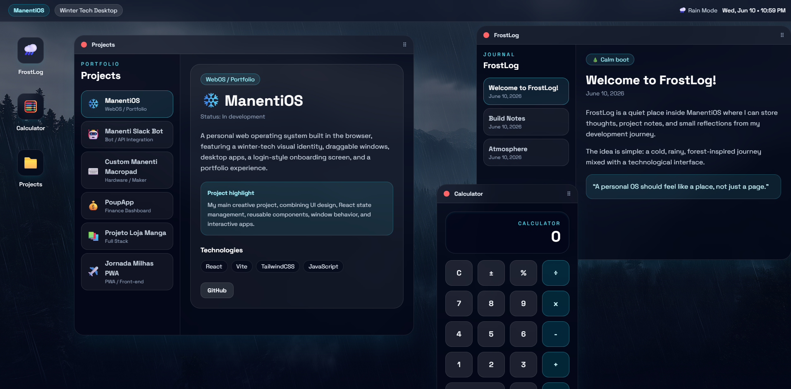

# ❄️ ManentiOS

A personal web operating system inspired by winter landscapes, rainy forests, glass interfaces, and modern technology.

## 🔗 Live Demo

[Open ManentiOS](https://manenti-os.vercel.app)

## 📸 Preview



---

## ✨ About the Project

**ManentiOS** is a browser-based personal operating system built as an interactive portfolio experience.
Instead of presenting my projects in a traditional website layout, ManentiOS turns them into apps inside a desktop-style interface.

The visual identity mixes a cold and atmospheric winter theme with a modern tech aesthetic: dark colors, glassmorphism, rain/forest inspiration, cyan highlights, and draggable app windows.

---

## 🧊 Features

- Login-style onboarding screen
- Desktop interface with wallpaper and top bar
- Live clock
- Draggable and closable windows
- Desktop icons with app launching
- Window layering with z-index behavior
- Portfolio app to showcase projects
- Calculator app
- FrostLog journal app
- Winter-tech visual identity

---

## 🖥️ Apps Included

### 🌧️ FrostLog

A small journal/log app inspired by rain, forests, and cold digital environments.

### 🧮 Calculator

A functional calculator app with basic operations.

### 🗂️ Projects

A portfolio app that displays some of my best projects, including web, bot, hardware, and full-stack work.

---

## 🛠️ Built With

- React
- Vite
- TailwindCSS
- JavaScript
- HTML
- CSS

---

## 🚀 Running Locally

Clone the repository:

```bash
git clone https://github.com/noname697/ManentiOS.git
```

Enter the project folder:

```bash
cd ManentiOS
```

Install dependencies:

```bash
npm install
```

Start the development server:

```bash
npm run dev
```

Open the local URL shown in your terminal, usually:

```bash
http://localhost:5173
```

---

## 🌲 Visual Theme

ManentiOS is inspired by:

- Winter landscapes
- Rainy forests
- Foggy mountains
- Dark glass interfaces
- Cold blue/cyan colors
- Personal desktop environments

The idea is to make the interface feel like a calm digital cabin inside a rainy winter forest.

---

## 👤 Author

Built by [noname697](https://github.com/noname697).
